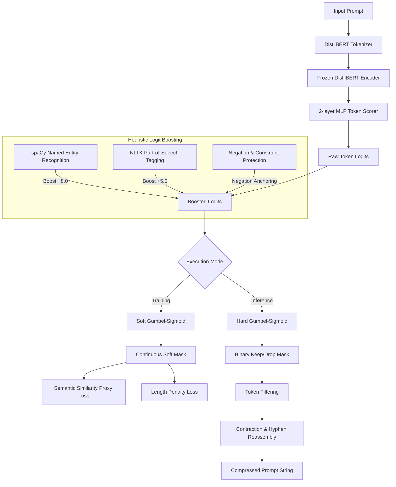

# PromptDistill

This repository implements learnable prompt compression using Gumbel-Softmax discrete optimization. It compresses system instructions and user prompts into shorter representations to reduce API costs and context window usage; the system preserves core semantic meaning.

## System Architecture

The workflow below illustrates the token scoring, heuristic boosting, and selection pipeline:



## Dependencies
*   **PyTorch**: Runs neural calculations and optimization.
*   **Transformers**: Provides contextual embeddings via the `distilbert-base-uncased` model.
*   **spaCy (en_core_web_sm)**: Identifies proper nouns via Named Entity Recognition.
*   **NLTK**: Performs Part-of-Speech tagging.
*   **Rich**: Generates the terminal user interface.

## Core Techniques

### Differentiable Token Selection
The system uses a Gumbel-Softmax estimator to approximate discrete choices. This approach allows end-to-end training using downstream rewards and length constraints.

### Named Entity Recognition Logit Boosting
spaCy detects proper nouns. The system adds a logit boost of 8.0 to these tokens during selection to prevent loss of names, dates, or locations.

### Part-of-Speech Content Boosting
NLTK identifies nouns, verbs, adjectives, numbers, and question words. The system adds a logit boost of 5.0 to these content tokens. It excludes auxiliary verbs to encourage their compression.

### Negation Anchoring
The system locks critical negation terms like not, no, never, without, and don't. These tokens remain in the output to preserve the logical meaning of instructions.

### Post-processing Spacing Cleanup
Hugging Face tokenizers split contractions and hyphenated words into sub-tokens. The output pipeline reconstructs these tokens into standard English text; it converts sequences like `don ' t` to `don't`.

## Test Metrics

These metrics represent performance of the default model checkpoint on a local CPU.

### Batch Evaluation (102 prompts)
*   Prompts processed: 102
*   Compression coefficient: 0.1
*   Input tokens: 1447
*   Output tokens: 1006
*   Mean reduction: 30.5%
*   Mean latency: 28.7 ms per prompt
*   Semantic preservation rate: 100% on standard tests (e.g., "What is the capital of india" becomes "what capital india")

### Complex Evaluation (8 prompts)
*   Prompts processed: 8 (averaging over 100 words each)
*   Mean reduction: 37.5%
*   Mean latency: 140.1 ms (560 ms first run initialization, 80 ms subsequent runs)
*   Constraint preservation: 100% of numbered rules, schemas, and code parameters preserved

## Project Structure

*   `prompt_optimizer/`: Source code including the evaluation engine, Gumbel-Softmax model, and training scripts.
*   `scripts/compress.py`: Command-line tool to test prompts and estimate cost savings.
*   `test_quality.py`: Tests for edge cases like contractions, negations, and formatting.
*   `test_batch.py`: Script to process 102 prompts and output CSV results.
*   `test_complex.py`: Script to process 8 long prompts and output CSV results.
*   `results/`: Directory containing output CSV files and charts.

## Usage

### Install Dependencies
```bash
uv sync
cp .env.example .env
# Edit .env to add your GEMINI_API_KEY
```

### Run CLI Tool
```bash
uv run python scripts/compress.py
```

### Run Batch Test
```bash
uv run python test_batch.py --lambda 0.1
```

### Run Complex Test
```bash
uv run python test_complex.py
```

### Run Quality Regression Tests
```bash
uv run python test_quality.py
```
